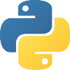
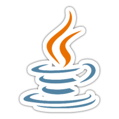
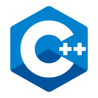
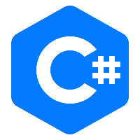
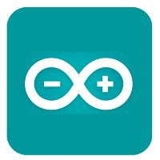

<h1 align="center">Kgs. Raka Renata</h2>

- 👋 Hi, I’m @rakaspecsyai
- 🤹 I'm generalist
- 👀 I’m interested in Machine Learning, Ethical Hacking, Robotics and Computer Vision
- 🌱 I’m currently student of Sriwijaya University 🏫
- 💞️ I’m looking to collaborate to cool projects 🖥️

  

  

<h2 align="center">Programming Languages and Technologies</h2>

---

---

<!---
rakaspecsyai/rakaspecsyai is a ✨ special ✨ repository because its `README.md` (this file) appears on your GitHub profile.
You can click the Preview link to take a look at your changes.
--->
